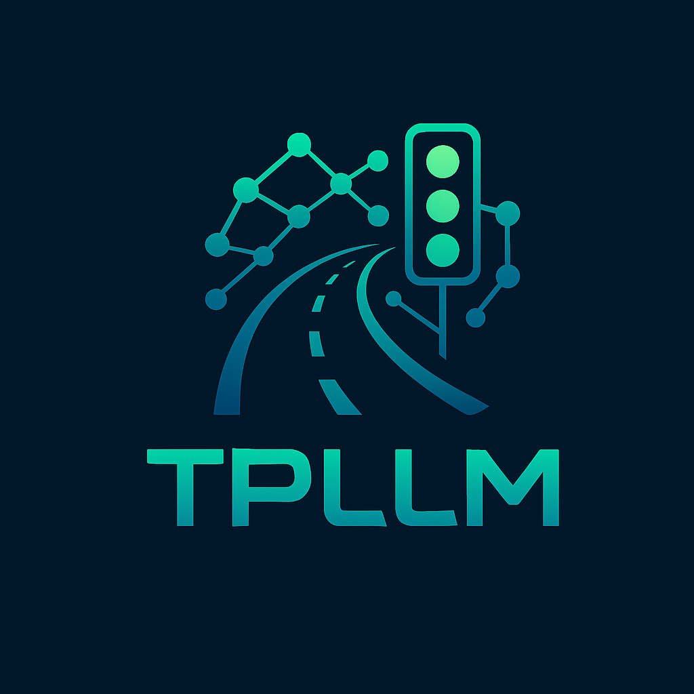

# TPL🚦 TPLLM - Traffic Prediction Large Language Model

🌐 Overview
TPLLM is an AI-driven framework designed to reduce traffic congestion and optimize vehicle flow in highly populated areas. It leverages LLMs (LLaMA-GPT style models), real-time traffic streaming data, and predictive analytics to forecast traffic conditions.

The system integrates MongoDB, Kafka streaming, TensorFlow LLaMA model, Prometheus/Grafana monitoring, and a Next.js dashboard, all containerized with Docker and ready for Kubernetes deployment.

⚙️ Features
✅ LLaMA GPT-style model fine-tuned on traffic data
✅ Real-time traffic streaming with Kafka
✅ RESTful Flask API with GPU support
✅ MongoDB storage for large-scale datasets
✅ Auto-retraining scheduler
✅ Prometheus & Grafana monitoring dashboards
✅ React/Next.js UI for live predictions
✅ Dockerized and K8s deployment-ready

🗂️ Project Structure
bash
Copy
Edit
TPLLM/
├── api/                 # Flask API, model, metrics, streaming, retraining
├── data/                # MongoDB data pipeline
├── tests/               # API test cases
├── frontend/            # Next.js Prediction Dashboard
├── docker-compose.yml   # Full stack Docker orchestration
├── kubernetes/          # K8s deployment YAMLs
├── prometheus.yml       # Prometheus config
├── grafana_dashboard.json # Grafana ready-to-import dashboard
└── README.md            # Project Documentation
🏗️ Setup & Initialization
1️⃣ Clone the Repository
bash
Copy
Edit
git clone https://github.com/your-org/TPLLM.git
cd TPLLM
2️⃣ Setup Python Environment
bash
Copy
Edit
cd api
python3 -m venv venv
source venv/bin/activate
pip install -r requirements.txt
3️⃣ Start Full Stack (Kafka, MongoDB, API, Prometheus, Grafana)
bash
Copy
Edit
docker-compose up --build
4️⃣ Access Endpoints
Service	URL
API	http://localhost:5000
MongoDB	mongodb://localhost:27017
Kafka	localhost:9092
Prometheus	http://localhost:9090
Grafana	http://localhost:3000
Frontend	http://localhost:3001
5️⃣ Run Streaming
bash
Copy
Edit
python api/stream_producer.py
python api/stream_consumer.py
6️⃣ Retrain & Evaluate
bash
Copy
Edit
python api/retrain.py
python api/evaluate.py
📊 Prometheus / Grafana Monitoring
Metrics: API requests, GPU utilization (optional)

Dashboard: Import grafana_dashboard.json into Grafana

Prometheus Scrape Target: tpllm-api:5000/metrics

🚀 Kubernetes Deployment
bash
Copy
Edit
kubectl apply -f kubernetes/tpllm-deployment.yml
kubectl get pods
kubectl get svc
🌍 Next.js Frontend Dashboard
bash
Copy
Edit
cd frontend
npm install
npm run dev
📚 Resources Required
Resource	Example
LLM Model	LLaMA 2, TensorFlow GPU
Database	MongoDB / MongoDB Atlas
Streaming	Apache Kafka / Confluent Cloud
Monitoring	Prometheus / Grafana Cloud
Compute	NVIDIA GPUs (A100 / T4 / V100)
Deployment	Docker, Kubernetes
✅ Roadmap / Next Tasks
 Kafka Consumer Batch Processor

 Nvidia GPU Metrics in Grafana

 CI/CD Pipeline (GitHub Actions)

 Helm Chart for K8s Deployment

 Role-based API Access Control (RBAC)

🤖 Author & Maintainers
Project Lead: [Prashant]
Organization: [Bharati Vidyapeeth's college of Engineering]
📧 Contact: prashantbansal529@gmail.com

📜 License
MIT License - Open Source Project for AI Traffic Prediction.

LM