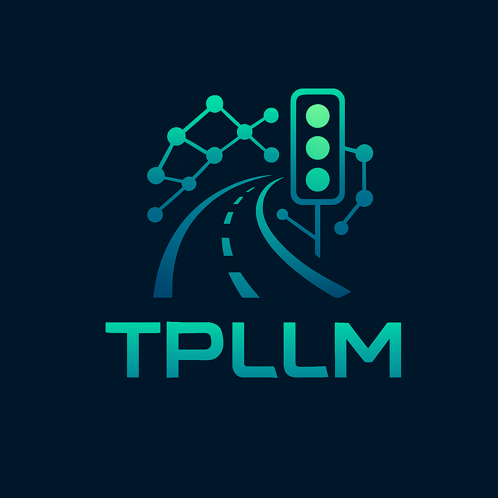

# TPL🚦 TPLLM - Traffic Prediction Large Language Model

🌐 Overview
TPLLM is an AI-driven framework designed to reduce traffic congestion and optimize vehicle flow in highly populated areas. It leverages LLMs (LLaMA-GPT style models), real-time traffic streaming data, and predictive analytics to forecast traffic conditions.

⚙️ Features
 -LLaMA GPT-style model fine-tuned on traffic data
 -RESTful Flask API with GPU support
 -MongoDB storage for large-scale datasets
 -React/Next.js UI for live predictions

🗂️ Project Structure

TPLLM/
├── api/                 # Flask API, model
├── data/                # MongoDB data pipeline
├── frontend/            # Next.js Prediction Dashboard
└── README.md           

 # Project Documentation
🏗️ Setup & Initialization
\#Clone the Repository
-bash
-Copy
-git clone https://github.com/your-org/TPLLM.git
-cd TPLLM
\#Setup Python Environment
-cd api
-python3 -m venv venv
-source venv/bin/activate
-pip install -r requirements.txt
\#Access Endpoints
Service	URL
API	http://localhost:5000
MongoDB	mongodb://localhost:27017
Frontend	http://localhost:3001

🤖 Author & Maintainers
Project Lead: [Prashant]

📧 Contact: prashantbansal529@gmail.com

📜 License
MIT License - Open Source Project for AI Traffic Prediction.

LM
